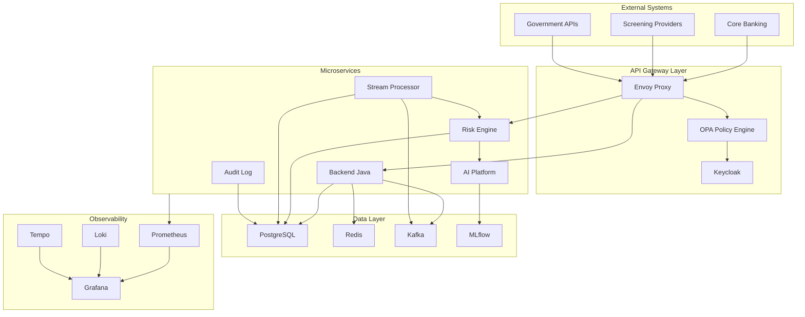

# Hafnium

[](https://github.com/olaflaitinen/hafnium/actions/workflows/ci.yaml)
[](https://github.com/olaflaitinen/hafnium/actions/workflows/security.yaml)
[](https://github.com/olaflaitinen/hafnium/actions/workflows/release-dry-run.yaml)
[](https://securityscorecards.dev/viewer/?uri=github.com/olaflaitinen/hafnium)
[](LICENSE)
[](https://github.com/olaflaitinen/hafnium/commits/main)
[](https://github.com/olaflaitinen/hafnium/graphs/commit-activity)
[](https://github.com/olaflaitinen/hafnium/graphs/contributors)
[](https://github.com/olaflaitinen/hafnium/issues)
[](https://github.com/olaflaitinen/hafnium/issues?q=is%3Aissue+is%3Aclosed)
[](https://github.com/olaflaitinen/hafnium/pulls)
[](https://github.com/olaflaitinen/hafnium/pulls?q=is%3Apr+is%3Aclosed)
[](https://github.com/olaflaitinen/hafnium)
[](https://github.com/olaflaitinen/hafnium)
[](https://github.com/olaflaitinen/hafnium)
[](https://github.com/olaflaitinen/hafnium)
[](https://github.com/olaflaitinen/hafnium/stargazers)
[](https://github.com/olaflaitinen/hafnium/network/members)
[](https://github.com/olaflaitinen/hafnium/watchers)
[](https://github.com/olaflaitinen/hafnium/releases)
[](https://github.com/olaflaitinen/hafnium/tags)

---

## Overview

Hafnium is a unified regulatory technology (RegTech) and cybersecurity platform designed for financial institutions. The platform provides comprehensive capabilities for customer due diligence, transaction monitoring, fraud prevention, and data security operations.

---

## Platform Architecture



---

## Core Engines

| Engine | Purpose | Key Capabilities |
|--------|---------|------------------|
| **KYC Flow** | Customer Onboarding | Document verification, identity validation, risk assessment |
| **AML Radar** | Transaction Monitoring | Real-time scoring, pattern detection, alert generation |
| **Shield** | Fraud Prevention | Behavioral analytics, anomaly detection, session security |
| **Vault** | Data Security | Tokenization, encryption, access control, audit logging |

---

## Technology Stack

### Backend Services

| Component | Technology | Version |
|-----------|------------|---------|
| API Gateway | Envoy | 1.28+ |
| Authentication | Keycloak | 23+ |
| Authorization | OPA | 0.60+ |
| Backend | Spring Boot | 3.2+ |
| Risk Engine | FastAPI | 0.109+ |
| Stream Processor | Faust | 1.10+ |

### Data Infrastructure

| Component | Technology | Purpose |
|-----------|------------|---------|
| Database | PostgreSQL | Primary data store |
| Cache | Redis | Session and feature cache |
| Message Broker | Kafka (Redpanda) | Event streaming |
| ML Registry | MLflow | Model versioning |

### AI/ML Platform

| Component | Technology | Purpose |
|-----------|------------|---------|
| Core Framework | PyTorch | Model training |
| Architecture | PINN | Physics-informed risk scoring |
| Serving | BentoML | Model inference |
| Feature Store | Feast | Feature management |

---

## Risk Score Formulation

The unified risk score is computed using a Physics-Informed Neural Network with the following objective:

$$
\mathcal{L} = \mathcal{L}_{supervised} + \lambda_1 \mathcal{L}_{monotonicity} + \lambda_2 \mathcal{L}_{smoothness} + \lambda_3 \mathcal{L}_{calibration}
$$

Where:

- $\mathcal{L}_{supervised}$: Binary cross-entropy loss
- $\mathcal{L}_{monotonicity}$: Penalizes negative gradients for monotonic features
- $\mathcal{L}_{smoothness}$: Gradient norm regularization
- $\mathcal{L}_{calibration}$: Expected Calibration Error

---

## Service Level Objectives

| Metric | Target | Measurement |
|--------|--------|-------------|
| API Latency (p95) | < 100ms | Prometheus histogram |
| API Latency (p99) | < 250ms | Prometheus histogram |
| Availability | 99.9% | Uptime monitoring |
| Error Rate | < 0.1% | Error count / total requests |
| Model Inference (p95) | < 50ms | Service metrics |

---

## Quick Start

### Prerequisites

- Docker 24.0+
- Docker Compose 2.20+
- Make 4.0+

### Development Setup

```bash
# Clone repository
git clone git@github.com:olaflaitinen/hafnium.git
cd hafnium

# Configure environment
cp .env.example .env

# Start development stack
make up

# Verify services
make health
```

### Service Endpoints

| Service | URL | Purpose |
|---------|-----|---------|
| Frontend | http://localhost:3000 | Web interface |
| Backend API | http://localhost:8080 | REST API |
| Risk Engine | http://localhost:8000 | Risk scoring |
| Keycloak | http://localhost:8081 | Authentication |
| Grafana | http://localhost:3001 | Monitoring |

---

## Documentation

| Category | Document | Description |
|----------|----------|-------------|
| Architecture | [Overview](docs/architecture/overview.md) | System architecture |
| Architecture | [Components](docs/architecture/components.md) | Service details |
| Architecture | [Data Model](docs/architecture/data-model.md) | Database schema |
| Security | [Threat Model](docs/threat-model/overview.md) | Security analysis |
| Compliance | [Overview](docs/compliance/overview.md) | Regulatory mapping |
| AI Platform | [PINN Specification](docs/ai/pinn-specification.md) | Model architecture |
| Operations | [Runbooks](docs/runbooks/operations.md) | Operations guides |
| Development | [Contributing](CONTRIBUTING.md) | Contribution guidelines |

---

## Project Structure

```
hafnium/
├── .github/                    # GitHub configuration
│   ├── workflows/              # CI/CD pipelines
│   └── ISSUE_TEMPLATE/         # Issue templates
├── contracts/                  # API specifications
│   ├── openapi/                # OpenAPI specs
│   ├── asyncapi/               # Event schemas
│   └── schemas/                # JSON schemas
├── docs/                       # Documentation
│   ├── architecture/           # Architecture docs
│   ├── ai/                     # AI platform docs
│   ├── compliance/             # Compliance docs
│   └── runbooks/               # Operations guides
├── infra/                      # Infrastructure
│   ├── k8s/                    # Kubernetes manifests
│   ├── helm/                   # Helm charts
│   └── terraform/              # Terraform configs
├── platform/                   # Platform services
│   ├── envoy/                  # API gateway
│   ├── keycloak/               # Authentication
│   └── policies/               # OPA policies
├── services/                   # Application services
│   ├── ai-platform/            # ML inference
│   ├── backend-java/           # Java backend
│   ├── frontend-react/         # React frontend
│   ├── risk-engine/            # Risk scoring
│   └── stream-processor/       # Event processing
└── scripts/                    # Development scripts
```

---

## License

This project is licensed under the Apache License 2.0. See [LICENSE](LICENSE) for details.

---

## Security

For security vulnerability reporting, see [SECURITY.md](SECURITY.md).

---

## Disclaimer

This software is provided for informational purposes only and does not constitute legal, financial, or compliance advice. Organizations must conduct their own regulatory compliance assessments. See [LEGAL_DISCLAIMER.md](LEGAL_DISCLAIMER.md) for full terms.

---

*Copyright 2025 Hafnium Platform Team. All rights reserved.*
