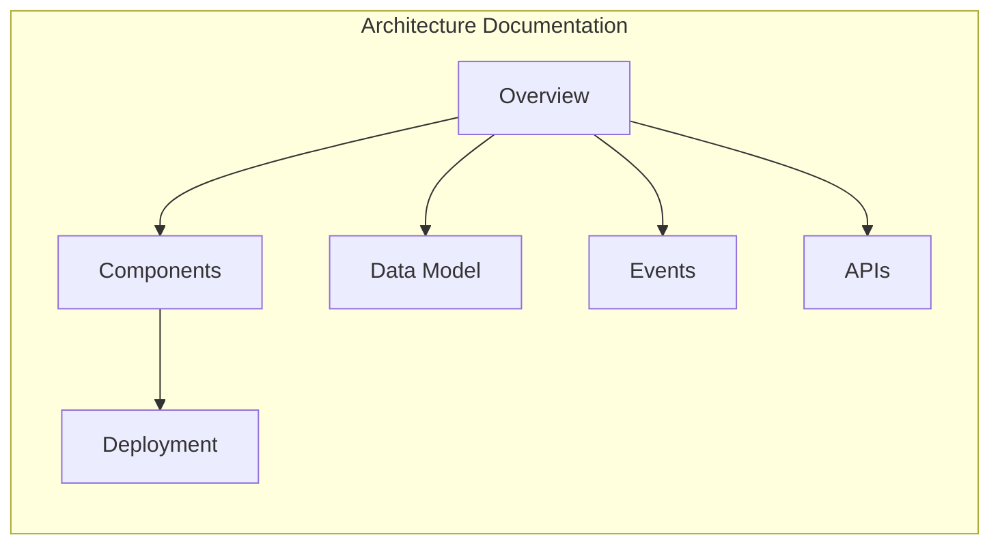

# Documentation Portal

This document serves as the central navigation hub for all Hafnium platform documentation.

---

## Table of Contents

1. [Quick Links](#quick-links)
2. [By Audience](#by-audience)
3. [Architecture](#architecture)
4. [AI Platform](#ai-platform)
5. [Security and Compliance](#security-and-compliance)
6. [Operations](#operations)
7. [Architecture Decisions](#architecture-decisions)

---

## Quick Links

| Document | Purpose |
|----------|---------|
| [README](../README.md) | Project overview |
| [CONTRIBUTING](../CONTRIBUTING.md) | Contribution guidelines |
| [SECURITY](../SECURITY.md) | Security policy |
| [REPO_SETUP](../REPO_SETUP.md) | Development setup |
| [CHANGELOG](../CHANGELOG.md) | Release history |

---

## By Audience

### Developers

| Document | Description |
|----------|-------------|
| [Repository Setup](../REPO_SETUP.md) | Local environment setup |
| [Contributing Guide](../CONTRIBUTING.md) | Development workflow |
| [Architecture Overview](architecture/overview.md) | System design |
| [API Reference](api/README.md) | API documentation |
| [ADR Index](adrs/README.md) | Design decisions |

### Security Engineers

| Document | Description |
|----------|-------------|
| [Security Policy](../SECURITY.md) | Vulnerability reporting |
| [Threat Model Overview](threat-model/overview.md) | Security analysis |
| [STRIDE Analysis](threat-model/stride.md) | Threat categories |
| [Privacy Policy](../PRIVACY.md) | Data handling |

### Compliance Officers

| Document | Description |
|----------|-------------|
| [Compliance Overview](compliance/overview.md) | Regulatory scope |
| [KYC/AML Mapping](compliance/kyc-aml.md) | Regulation controls |
| [Auditability](compliance/auditability.md) | Audit capabilities |
| [Legal Disclaimer](../LEGAL_DISCLAIMER.md) | Liability terms |

### Operations

| Document | Description |
|----------|-------------|
| [Local Development](runbooks/local-development.md) | Dev environment |
| [Operations Guide](runbooks/operations.md) | Production ops |
| [Incident Response](runbooks/incident-response.md) | Incident handling |
| [Release Process](release/release-process.md) | Release workflow |

---

## Architecture

| Document | Description |
|----------|-------------|
| [Overview](architecture/overview.md) | High-level architecture |
| [Components](architecture/components.md) | Service descriptions |
| [Data Model](architecture/data-model.md) | Database schema |
| [Events](architecture/events.md) | Event schemas |
| [APIs](architecture/apis.md) | API design |
| [Deployment](architecture/deployment.md) | Infrastructure |

---

## AI Platform

| Document | Description |
|----------|-------------|
| [Engineering Handbook](ai/engineering-handbook.md) | Development standards |
| [Model Governance](ai/model-governance.md) | Lifecycle management |
| [PINN Specification](ai/pinn-specification.md) | Model architecture |
| [Benchmarking Protocol](ai/benchmarking-protocol.md) | Evaluation methods |
| [LLM Safety](ai/llm-redaction-and-safety.md) | Privacy guardrails |

---

## Security and Compliance

### Threat Modeling

| Document | Description |
|----------|-------------|
| [Overview](threat-model/overview.md) | Threat model summary |
| [STRIDE Analysis](threat-model/stride.md) | Threat categories |
| [LINDDUN Analysis](threat-model/linddun.md) | Privacy threats |

### Compliance

| Document | Description |
|----------|-------------|
| [Overview](compliance/overview.md) | Regulatory scope |
| [KYC/AML](compliance/kyc-aml.md) | AML requirements |
| [Auditability](compliance/auditability.md) | Audit controls |

---

## Operations

| Document | Description |
|----------|-------------|
| [Local Development](runbooks/local-development.md) | Development setup |
| [Operations](runbooks/operations.md) | Production operations |
| [Incident Response](runbooks/incident-response.md) | Incident handling |

---

## Architecture Decisions

| ADR | Title |
|-----|-------|
| [0000](adrs/0000-template.md) | ADR Template |
| [0001](adrs/0001-architecture-style.md) | Architecture Style |
| [0002](adrs/0002-stream-processing-choice.md) | Stream Processing |
| [0003](adrs/0003-model-serving-choice.md) | Model Serving |
| [0004](adrs/0004-feature-store-choice.md) | Feature Store |
| [0005](adrs/0005-secrets-management.md) | Secrets Management |

---

## Document Conventions

### Structure

All documents follow this structure:

1. **Title**: Document name
2. **Purpose**: What the document covers
3. **Scope**: Boundaries and limitations
4. **Content**: Main body
5. **References**: Related documents
6. **Change Control**: Revision history

### Diagrams

All diagrams use Mermaid syntax for consistency and version control.

### Formulas

Mathematical formulas use LaTeX notation within `$$` blocks.

---

*Last Updated: 2025-12-16*
