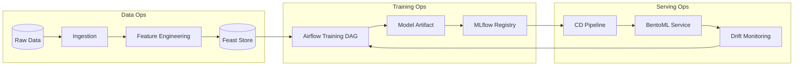

# AI Engineering Handbook

**Hafnium AI Platform Reference Documentation**

---

## Overview

This handbook provides comprehensive guidance for developing, deploying, and operating AI/ML systems within the Hafnium platform. It establishes standards for model development, governance, and compliance with regulatory requirements.

---

## Table of Contents

1. [Development Standards](#development-standards)
2. [Model Architecture](#model-architecture)
3. [Training Infrastructure](#training-infrastructure)
4. [Feature Engineering](#feature-engineering)
5. [Model Governance](#model-governance)
6. [Deployment and Serving](#deployment-and-serving)
7. [Monitoring and Observability](#monitoring-and-observability)
8. [Privacy and Security](#privacy-and-security)

---

## Development Standards

### Code Quality

All AI/ML code must adhere to:

- **Type Hints**: Full type annotations for Python code
- **Documentation**: Docstrings for all public functions
- **Testing**: Unit tests with >80% coverage
- **Linting**: Ruff for style, Pyright for type checking

### Reproducibility

All experiments must be reproducible:

```python
# Set random seeds
import random
import numpy as np
import torch

def set_seed(seed: int = 42) -> None:
    random.seed(seed)
    np.random.seed(seed)
    torch.manual_seed(seed)
    torch.cuda.manual_seed_all(seed)
    torch.backends.cudnn.deterministic = True
```

### Version Control

- **Code**: Git with conventional commits
- **Data**: DVC (Data Version Control)
- **Models**: MLflow Model Registry
- **Experiments**: MLflow Tracking

---

## Model Architecture

### Physics-Informed Neural Network (PINN)

The PINN architecture encodes domain constraints:

```
┌─────────────────────────────────────────────────────────┐
│                    Input Features                        │
│   (transaction, customer, velocity, network features)   │
└─────────────────────────────────────────────────────────┘
                            │
                            ▼
┌─────────────────────────────────────────────────────────┐
│                  Monotonic MLP Backbone                  │
│   - Hidden layers with ReLU activation                  │
│   - Constrained weights for monotonic features          │
└─────────────────────────────────────────────────────────┘
                            │
                            ▼
┌─────────────────────────────────────────────────────────┐
│                    Risk Score Head                       │
│   - Sigmoid output [0, 1]                               │
│   - Temperature scaling for calibration                 │
└─────────────────────────────────────────────────────────┘
                            │
                            ▼
┌─────────────────────────────────────────────────────────┐
│              Physics-Informed Loss Function              │
│   L = L_supervised + λ₁L_monotonicity + λ₂L_smoothness  │
└─────────────────────────────────────────────────────────┘
```

### Monotonicity Constraints

Features with enforced monotonicity:

| Feature | Direction | Rationale |
|---------|-----------|-----------|
| transaction_amount | Positive | Higher amounts → higher risk |
| velocity_24h | Positive | More transactions → higher risk |
| days_since_onboarding | Negative | Older accounts → lower risk |
| failed_auth_attempts | Positive | More failures → higher risk |

---

## Training Infrastructure

### Pipeline Orchestration

Training pipelines use Airflow/Prefect:

```yaml
# Example DAG structure
training_pipeline:
  - data_extraction
  - feature_engineering
  - train_test_split
  - model_training
  - model_evaluation
  - model_registration
  - model_deployment (conditional)
```

### Compute Resources

| Stage | Resource | Specification |
|-------|----------|---------------|
| Feature Engineering | CPU | 8 cores, 32GB RAM |
| Training | GPU | NVIDIA A10G (24GB) |
| Inference | CPU/GPU | Auto-scaled based on load |

### Hyperparameter Tuning

Use Optuna for hyperparameter optimization:

```python
def objective(trial: optuna.Trial) -> float:
    lr = trial.suggest_float("lr", 1e-5, 1e-2, log=True)
    hidden_dim = trial.suggest_int("hidden_dim", 64, 512)
    n_layers = trial.suggest_int("n_layers", 2, 6)
    # ... training logic
    return validation_auc
```

---

## Feature Engineering

### Feature Store Integration

Features are managed via Feast:

```python
from feast import FeatureStore

store = FeatureStore(repo_path="feature_repo/")

features = store.get_online_features(
    features=[
        "customer_features:velocity_24h",
        "customer_features:total_transaction_count",
        "network_features:counterparty_risk_score",
    ],
    entity_rows=[{"customer_id": "cust_12345"}],
)
```

### Feature Documentation

All features must be documented:

| Feature | Type | Description | Source |
|---------|------|-------------|--------|
| velocity_24h | float | Transaction count in 24h | Stream processor |
| days_since_onboarding | int | Days since customer created | Customer DB |
| geo_risk_score | float | Risk score of transaction location | External API |

---

## MLOps Pipeline architecture



---

## Model Governance

### Model Card Requirements

All production models require a model card:

```yaml
model_card:
  model_id: unified-risk-v1
  name: Unified Risk Score Model
  version: 1.0.0
  
  intended_use:
    primary_use: Transaction risk scoring
    out_of_scope: Credit decisioning, fraud investigation
  
  metrics:
    auc_roc: 0.92
    auc_pr: 0.85
    ece: 0.03
  
  limitations:
    - Performance may degrade on new fraud patterns
    - Calibration validated only for US transactions
  
  ethical_considerations:
    - Fairness audited across demographic groups
    - No direct use of protected attributes
```

### Approval Workflow

```
Model Development → Validation → Security Review → Compliance Review → Production
```

---

## Deployment and Serving

### Inference Service

Models are served via BentoML:

```python
import bentoml
from bentoml.io import JSON

@bentoml.service
class RiskScoringService:
    def __init__(self):
        self.model = bentoml.pytorch.load_model("unified-risk:latest")
    
    @bentoml.api(input=JSON(), output=JSON())
    def predict(self, input_data: dict) -> dict:
        # Inference logic
        pass
```

### A/B Testing

New models are deployed via canary:

| Stage | Traffic | Duration |
|-------|---------|----------|
| Canary | 5% | 24 hours |
| Staged | 25% | 48 hours |
| Full | 100% | Ongoing |

---

## Monitoring and Observability

### Model Metrics

| Metric | Description | Alert Threshold |
|--------|-------------|-----------------|
| Prediction Latency | p99 latency | > 100ms |
| Throughput | Requests/second | < 100 rps |
| Feature Drift | KL divergence | > 0.1 |
| Prediction Drift | Score distribution shift | > 0.05 |

### Dashboards

- Model Performance Dashboard
- Feature Drift Dashboard
- Inference Latency Dashboard

---

## Privacy and Security

### Data Handling

- PII excluded from training data
- Synthetic data for development
- Differential privacy where applicable

### Model Security

- Adversarial robustness testing
- Model extraction prevention
- Input validation and sanitization

---

**DISCLAIMER**: This handbook provides technical guidance only. Organizations must conduct their own risk assessments and compliance reviews.

*Last Updated: 2025-12-16*
