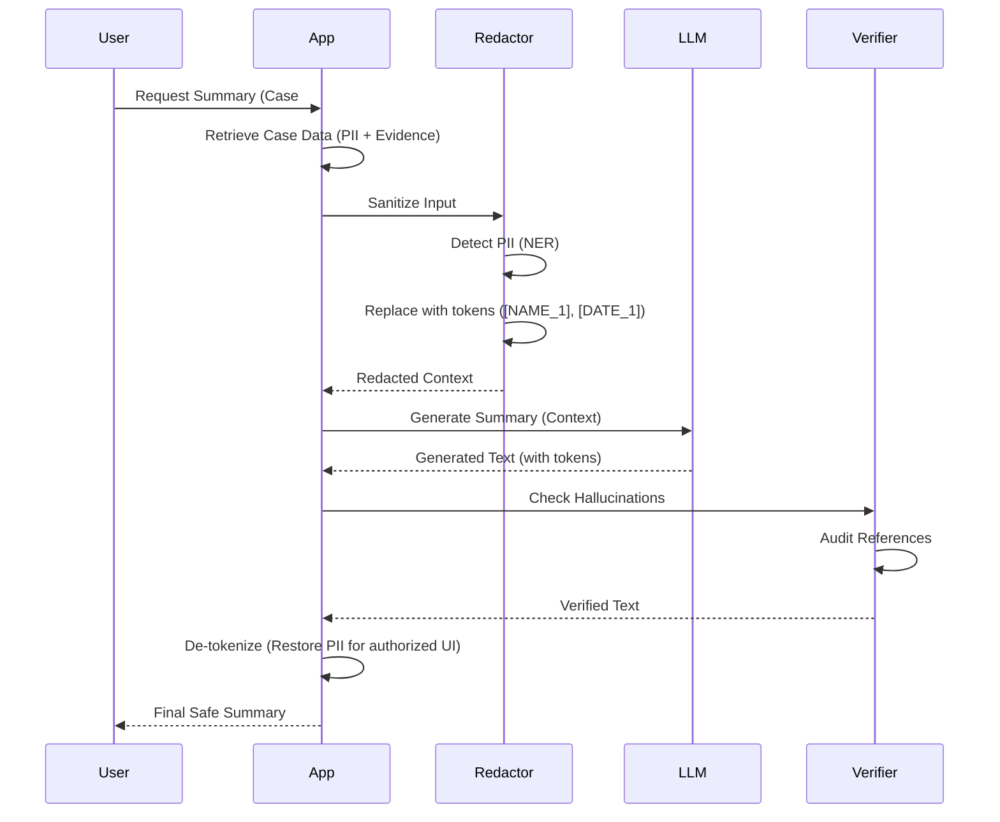

# LLM Redaction & Safety Guidelines

This document establishes the safety protocols for integrating Large Language Models (LLMs) within the Hafnium platform, specifically regarding PII protection and hallucination control.

---

## 1. Data Flow Architecture

---

## 2. Redaction Standards

Before any data is sent to an external or hosted LLM, strictly identifiable information must be redacted.

| Entity Type | Action | Replacement Token |
|-------------|--------|-------------------|
| Person Name | Mask | `[PERSON_ID]` |
| Credit Card | Mask | `[CARD_ID]` |
| SSN/Tax ID | Mask | `[TAX_ID]` |
| Address | Partial | `[CITY], [COUNTRY]` |
| Amounts | Keep | (Preserved for context) |

### Implementation

We use a deterministic Named Entity Recognition (NER) pipeline combined with regex patterns.

- **Library**: Presidio / Custom spaCy model.
- **Fallback**: If confidence < 0.9, treat as sensitive.

---

## 3. Safety Guardrails

### Input Guardrails

- **Prompt Injection**: All prompts are wrapped in delineators.
- **Context Limit**: Maximum 8k tokens to prevent context overflow attacks.

### Output Guardrails

- **Hallucination Check**: Generated claims must cite a source ID from the provided context.
- **Toxic Content**: Output is scanned for harmful language.
- **Refusal**: The model is instructed to refuse requests outside the domain of financial crime investigation.

---

## 4. Human-in-the-Loop (HITL)

AI-generated summaries are **decision support tools**, not decision makers.

- **UI Label**: All AI content is visibly labeled "AI Generated - Verify with Source".
- **Feedback Loop**: Analysts can flag incorrect summaries to improve the evaluation dataset.
