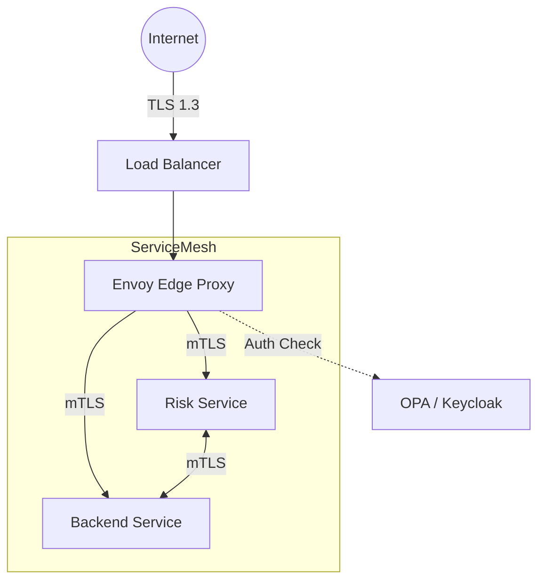

# API Architecture

This document outlines the API design standards, security protocols, and gateway architecture for the Hafnium platform.

---

## API Gateway Pattern



### Gateway Responsibilities
- **Termination**: TLS 1.3 termination.
- **Authentication**: JWT signature verification (JWKS).
- **Rate Limiting**: Token bucket algorithm per IP/Client.
- **Routing**: Path-based routing to microservices.
- **Observability**: Request tracing (OpenTelemetry) and metrics.

---

## REST API Standards

All synchronous service interfaces follow **REST Level 2** maturity:

### 1. Versioning
URI Path Versioning is mandatory.
- `GET /api/v1/customers`
- `POST /api/v1/risk/score`

### 2. HTTP Methods

| Method | Idempotent | Safe | Role |
|--------|------------|------|------|
| GET | Yes | Yes | Retrieve resource |
| POST | No | No | Create resource / Trigger action |
| PUT | Yes | No | Replace resource completely |
| PATCH | No | No | Partial update |
| DELETE | Yes | No | Remove resource |

### 3. Response Structure

Standard JSON envelope for all responses:

```json
{
  "data": { ... },       // Content for 2xx
  "meta": {              // Pagination, tracing
    "trace_id": "ab12...",
    "page": 1,
    "total": 100
  },
  "error": null          // Present only on 4xx/5xx
}
```

### 4. Error Handling (RFC 7807)

```json
{
  "type": "https://hafnium.io/errors/validation",
  "title": "Invalid Risk Request",
  "status": 400,
  "detail": "Amount must be positive",
  "instance": "/api/v1/risk/score"
}
```

---

## API Catalog

| Service | Base Path | Auth Scope | Description |
|---------|-----------|------------|-------------|
| **Risk** | `/api/v1/risk` | `risk:write` | Real-time scoring endpoint |
| **Cases** | `/api/v1/cases` | `case:read` | Case management workflow |
| **Customers** | `/api/v1/customers` | `cust:read` | Entity management |
| **Reports** | `/api/v1/reports` | `report:gen` | Regulatory reporting |

---

## Idempotency

All mutation endpoints (`POST`, `PATCH`) support the `Idempotency-Key` header.
- The gateway caches the response for the key for 24 hours.
- Replayed requests receive the cached response without re-processing.

---

## GraphQL (Future)

*Status: Under Review*
A GraphQL aggregations layer (`/graphql`) is planned for the Frontend-for-Backend (BFF) pattern to reduce chatter on the analyst dashboard.
