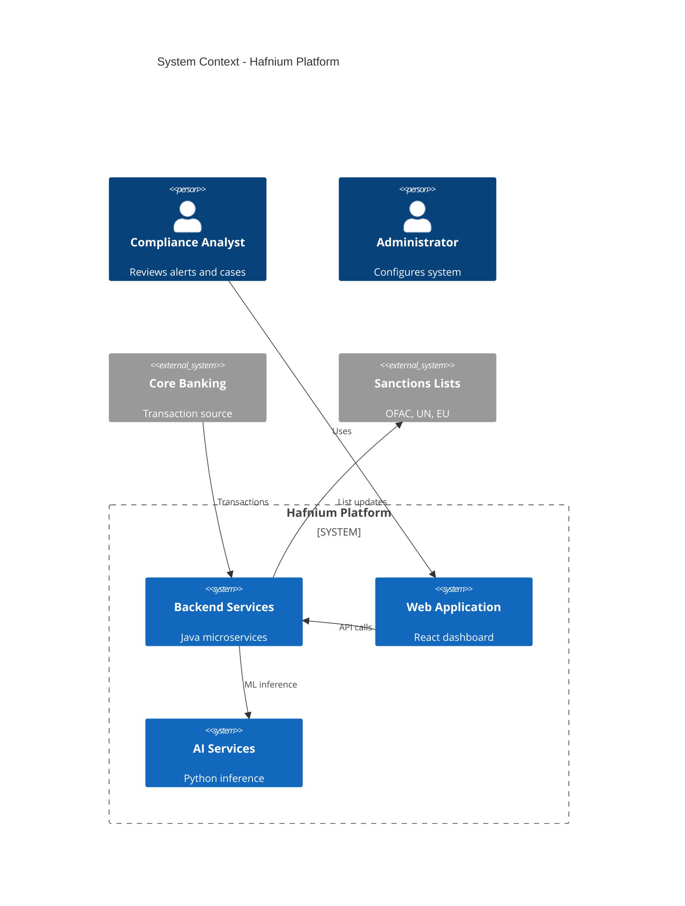
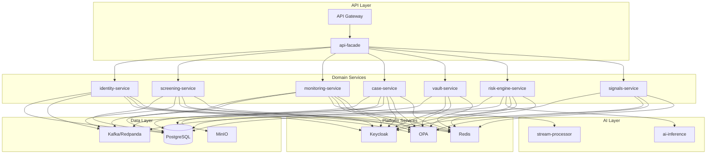
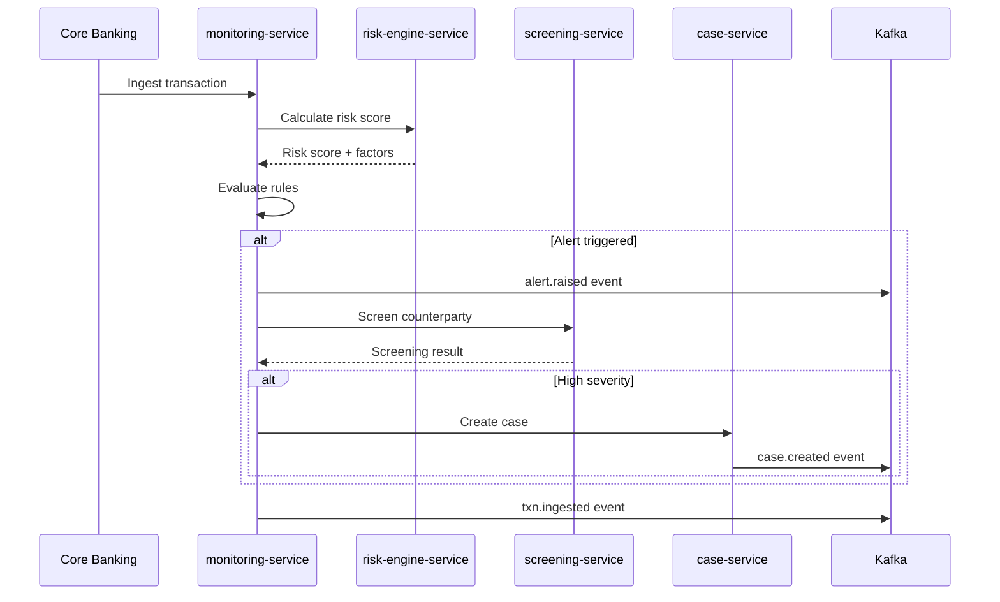
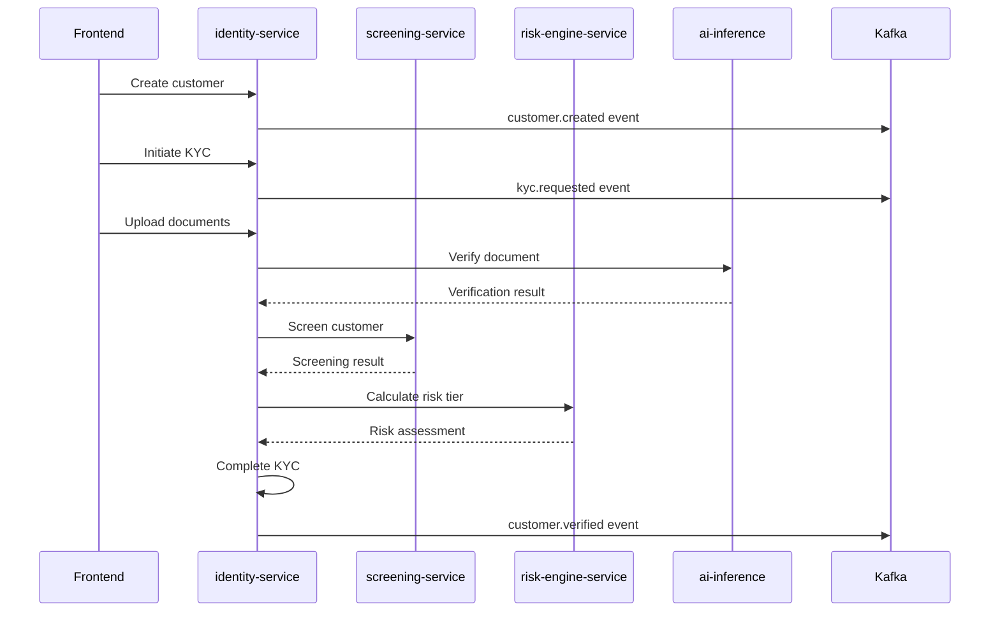
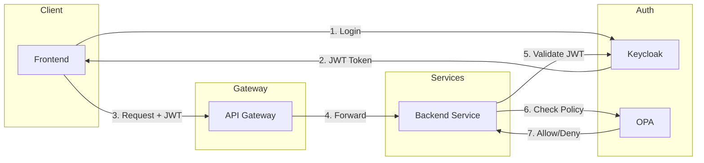

# Hafnium Backend Architecture

## Overview

The Hafnium backend is a distributed system of Java microservices implementing a comprehensive AML/KYC compliance platform. The architecture follows domain-driven design principles with event-driven communication.

## System Context

## Service Architecture

## Service Responsibilities

### identity-service
- Customer onboarding and lifecycle
- KYC workflow orchestration
- Document collection and verification
- Integration with AI for document analysis

### screening-service
- Sanctions and PEP list matching
- Fuzzy matching algorithms (Jaro-Winkler, Levenshtein)
- Match disposition workflow
- List import and update management

### monitoring-service
- Real-time transaction ingestion
- Rule engine evaluation
- Alert generation and prioritization
- Anomaly detection integration

### case-service
- Investigation case management
- Evidence collection and storage
- Workflow state machine
- AI-powered case summarization

### vault-service
- PII tokenization boundary
- Deterministic tokenization (HMAC)
- Encryption at rest (AES-GCM)
- Key management integration

### risk-engine-service
- Unified risk scoring
- Rule-based risk assessment
- ML model inference integration
- Decision persistence for audit

### signals-service
- Device fingerprint analysis
- Session risk evaluation
- Step-up authentication policies
- Behavioral analytics hooks

### api-facade
- Unified API surface for frontend
- Cross-service aggregation
- Consistent error handling
- Rate limiting and caching

## Data Flow

### Transaction Monitoring Flow

### KYC Workflow Flow

## Security Architecture

### Authentication & Authorization

### Multi-Tenancy

- Tenant ID extracted from JWT claims
- All queries scoped by tenant_id
- Row-Level Security (RLS) in PostgreSQL
- Tenant context propagated via ThreadLocal

## Technology Stack

| Layer | Technology |
|-------|------------|
| Language | Java 21 |
| Framework | Spring Boot 3.2 |
| Database | PostgreSQL 15 |
| Messaging | Apache Kafka (Redpanda) |
| Cache | Redis |
| Auth | Keycloak |
| AuthZ | Open Policy Agent |
| Storage | MinIO |
| Observability | Prometheus, Grafana, Tempo |
