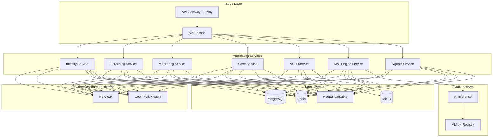
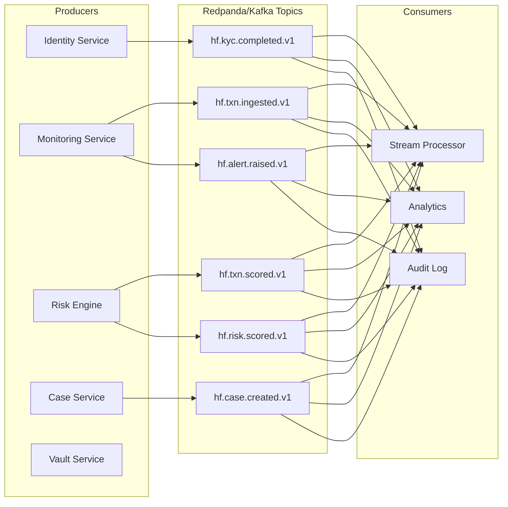
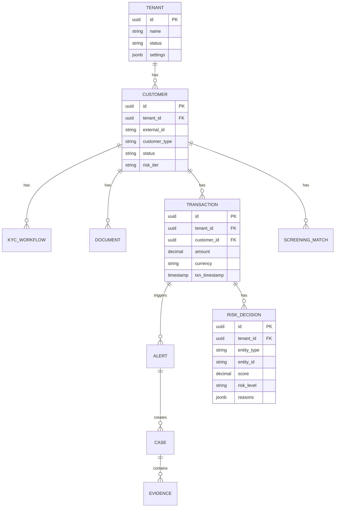
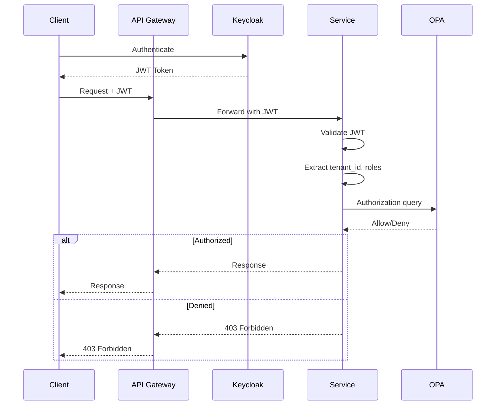
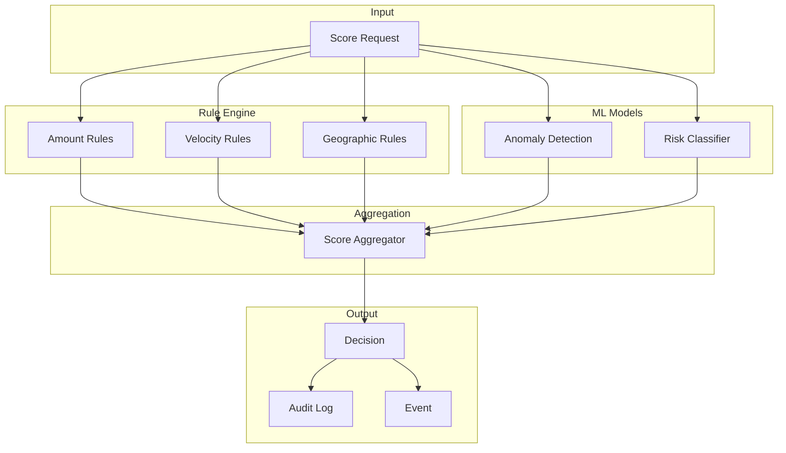
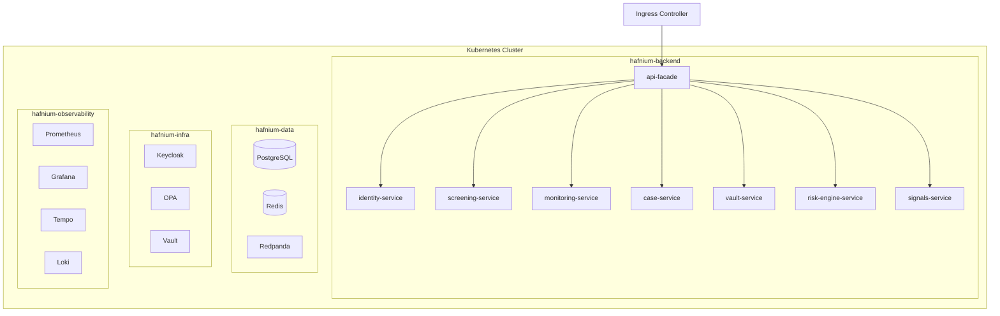

# Backend Architecture

## Overview

The Hafnium backend is implemented as a microservices architecture using Spring Boot 3.2 and Java 21. Services communicate via REST APIs and asynchronous events through Kafka/Redpanda.

## Service Architecture

## Event-Driven Architecture

## Data Model

## Service Catalog

| Service | Port | Schema | Description |
|---------|------|--------|-------------|
| identity-service | 8080 | identity | KYC workflow orchestration |
| screening-service | 8081 | screening | Sanctions/PEP matching |
| monitoring-service | 8082 | monitoring | Transaction monitoring |
| case-service | 8083 | cases | Case management |
| vault-service | 8084 | vault | PII tokenization |
| risk-engine-service | 8085 | risk | Unified risk scoring |
| signals-service | 8086 | signals | Security signals |
| api-facade | 8087 | - | API gateway |

## Security Architecture

## Risk Scoring Flow

## Technology Stack

### Runtime
- Java 21 (LTS)
- Spring Boot 3.2
- Spring Security OAuth2 Resource Server

### Data
- PostgreSQL 16 with per-service schemas
- Redis 7 for caching and sessions
- Flyway for migrations

### Messaging
- Redpanda (Kafka-compatible)
- JSON event encoding with schema versioning

### Observability
- Micrometer + Prometheus metrics
- OpenTelemetry tracing
- Loki for log aggregation
- Grafana dashboards

### Security
- Keycloak for identity
- OPA for policy decisions
- HashiCorp Vault for secrets

## Deployment Architecture

## Configuration

Services are configured via environment variables with defaults for local development:

| Variable | Description | Default |
|----------|-------------|---------|
| `DB_HOST` | PostgreSQL host | localhost |
| `DB_PORT` | PostgreSQL port | 5432 |
| `KAFKA_BOOTSTRAP_SERVERS` | Kafka brokers | localhost:9092 |
| `KEYCLOAK_ISSUER_URI` | Keycloak issuer | http://localhost:8081/realms/hafnium |
| `OPA_URL` | OPA server | http://localhost:8181 |
| `AI_INFERENCE_URL` | AI inference service | http://localhost:8001 |

## Quality Gates

- Code formatting: Spotless (Google Java Format)
- Static analysis: Error Prone
- Testing: JUnit 5 + Testcontainers
- Security: CodeQL, Trivy, OWASP Dependency Check
