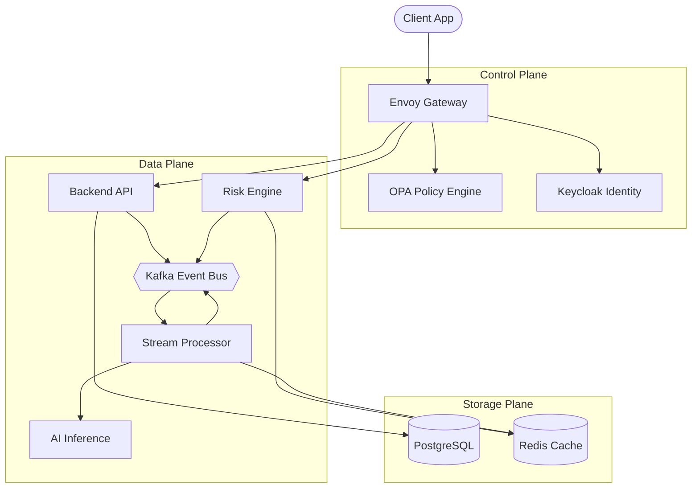

# Component Architecture

This document details the distinct microservices and components comprising the Hafnium platform.

---

## Service Inventory

| Service | Type | Language | Responsibility |
|---------|------|----------|----------------|
| **Risk Engine** | Core | Python (FastAPI) | Real-time transaction scoring, model inference |
| **Stream Processor** | Core | Python (Faust) | Event ingestion, enrichment, pattern detection |
| **Backend API** | Core | Java (Spring Boot) | Entity management, workflow orchestration, audit |
| **Frontend** | UI | TypeScript (React) | Analyst dashboard, case management interface |
| **AI Platform** | ML | Python | Model training, experimental tracking, serving |
| **Audit Log** | Support | Python | Immutable compliance logging |

---

## Component Interaction Diagram

---

## Detailed Component Specifications

### 1. Risk Engine (`services/risk-engine`)

- **Purpose**: Calculates risk scores for transactions in near real-time.
- **Inputs**: Transaction payload, customer profile, velocity features.
- **Outputs**: Risk score (0.0-1.0), risk tier, contributing factors.
- **Dependencies**: Redis (feature cache), AI Platform (model artifacts).
- **Scale Strategy**: Stateless, horizontally scalable behind load balancer.

### 2. Stream Processor (`services/stream-processor`)

- **Purpose**: Processes high-throughput event streams for fraud detection.
- **Technology**: Faust (Python streaming library).
- **Topology**:
    1. **Ingest**: Raw transaction topic.
    2. **Enrich**: Join with customer dimension table (KTable).
    3. **Detect**: Evaluate rules and ML models.
    4. **Alert**: Emit to alerts topic if threshold breached.

### 3. Backend API (`services/backend-java`)

- **Purpose**: Manages system of record entities (Customer, Case, Report).
- **Framework**: Spring Boot 3.2.
- **Key Modules**:
  - `customer-service`: KYC/CDD data management.
  - `case-service`: Investigation workflow state machine.
  - `report-service`: Regulatory report generation (SAR/CTR).

### 4. AI Platform (`services/ai-platform`)

- **Purpose**: Provides MLOps infrastructure for the risk model lifecycle.
- **Components**:
  - **Training**: Airflow DAGs for retraining.
  - **Registry**: MLflow model versioning.
  - **Serving**: BentoML inference containers.

---

## Interfaces & Boundaries

### API Gateway (Ingress)

All external traffic enters via Envoy. Authentication is terminated at the gateway via JWT validation against Keycloak public keys.

### Event Bus (Async)

Inter-service communication for non-blocking operations uses Kafka. All messages are serialized using Avro schemas.

### Data Persistence

- **PostgreSQL**: System of record. Relational integrity required.
- **Redis**: Ephemeral state, sliding windows, feature store online serving.
- **MinIO**: Object storage for documents (KYC evidence) and model artifacts.
