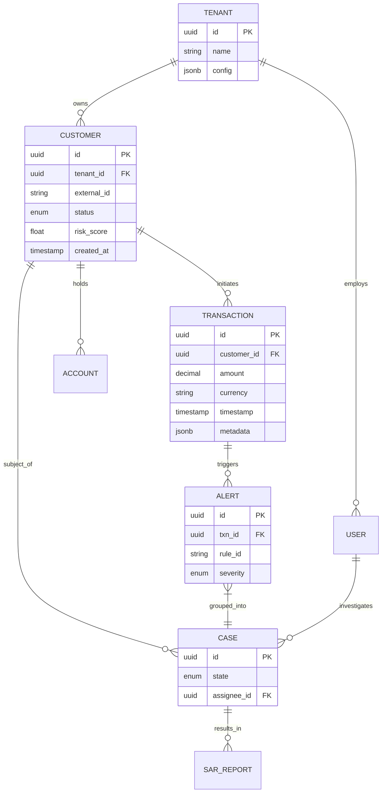
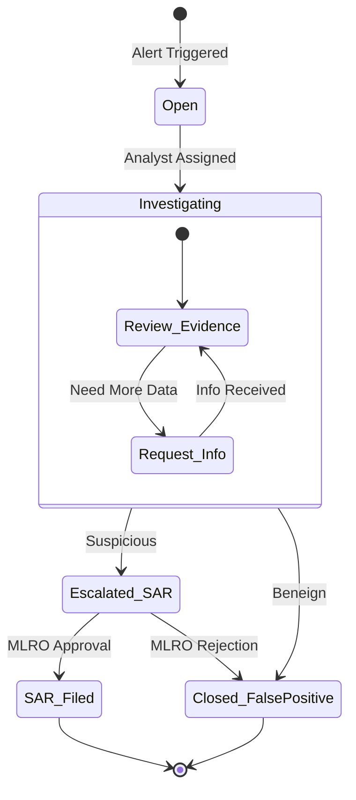

# Data Model Specification

This document defines the core entity relationship model and schema standards for the Hafnium platform.

---

## Entity Relationship Diagram

---

## Case Lifecycle State Machine

---

## Schema Definitions

### Database Standards

- **Dialect**: PostgreSQL 15+
- **Primary Keys**: UUID v4 (Random)
- **Timezones**: UTC always (`TIMESTAMPTZ`)
- **Strings**: `TEXT` (no arbitrary `VARCHAR(n)` limits unless strictly required)
- **Money**: `DECIMAL(19, 4)` for high precision currency

### Core Tables

#### 1. Customers (`customers`)

| Column | Type | Nullable | Description |
|--------|------|----------|-------------|
| `id` | UUID | No | Primary Key |
| `tenant_id` | UUID | No | Multi-tenancy isolation key |
| `external_id` | TEXT | No | ID in upstream banking core |
| `risk_tier` | ENUM | No | `LOW`, `MEDIUM`, `HIGH`, `CRITICAL` |
| `kyc_status` | ENUM | No | `PENDING`, `VERIFIED`, `REJECTED` |

#### 2. Transactions (`transactions`)

| Column | Type | Nullable | Description |
|--------|------|----------|-------------|
| `id` | UUID | No | Primary Key |
| `account_id` | UUID | No | Source account |
| `amount` | DECIMAL | No | Transaction value |
| `currency` | CHAR(3) | No | ISO 4217 Currency Code |
| `counterparty` | JSONB | Yes | Receiver details (PII redacted) |

---

## Data Lifecycle

| Entity | Retention Period | Archival Strategy | Deletion Policy |
|--------|------------------|-------------------|-----------------|
| Transaction | 5 years | Cold storage after 1 year | Hard delete (GDPR) |
| Audit Log | 7 years | WORM storage (S3 Object Lock) | Never (Regulatory) |
| Customer PII | Contract + 2y | Encrypted at rest | Crypto-shredding |
| Alert | 3 years | Summarized after 6 months | Bulk purge |

---

## Data Classification

| Level | Definition | Examples | Handling |
|-------|------------|----------|----------|
| **Public** | Non-sensitive | API Specs, Public Keys | No specific controls |
| **Internal** | Business operations | Internal IDs, Metadata | AuthZ required |
| **Confidential** | PII / Financial | Name, Address, Txn Amount | Encryption at rest, Need-to-know |
| **Restricted** | Critical Secrets | Private Keys, Passwords | Hardware security module (HSM) |

---

## Feature Store Schema

For AI models, features are defined in the online store (Redis):

| Feature Name | Type | Window | Description |
|--------------|------|--------|-------------|
| `txn_velocity_1h` | Int64 | 1 hour | Count of txns in last hour |
| `txn_velocity_24h` | Int64 | 24 hours | Count of txns in last day |
| `sum_amount_7d` | Float | 7 days | Total volume in last week |

Feature keys follow the pattern: `entity:{entity_id}:feature:{feature_name}`.
