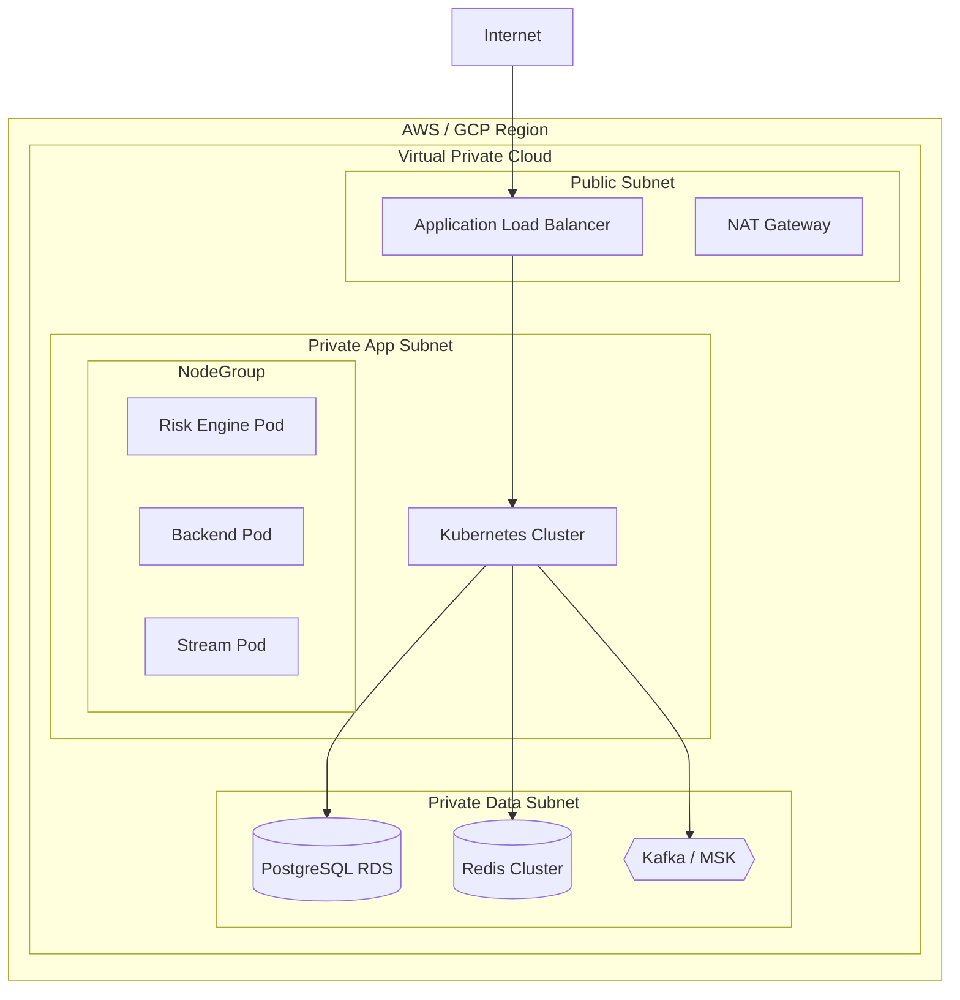

# Deployment Architecture

This document describes the infrastructure topology and deployment strategies for Hafnium.

---

## Infrastructure Taxonomy



---

## Container Strategy

### Base Images
- **Distroless** (Google) for production runtimes to minimize attack surface.
- **Alpine** for utility jobs.
- **UBI** (Universal Base Image) for enterprise compliance requirements.

### Orchestration (Kubernetes)
- **Ingress**: NGINX or AWS ALB Controller.
- **Service Mesh**: Linkerd (lightweight) or Istio (enterprise).
- **Autoscaling**:
    - **HPA**: Horizontal Pod Autoscaler based on CPU/Memory/Lag.
    - **Cluster Autoscaler**: Node provisioning.

---

## Environment Tiering

| Environment | Purpose | Deployment Strategy | Data Privacy |
|-------------|---------|---------------------|--------------|
| **Dev** | Feature development | CD (On Push) | Synthetic Data |
| **Staging** | Integration testing | CD (On Merge) | Anonymized Prod |
| **Prod** | Live traffic | Blue/Green or Canary | Real Data |
| **DR** | Disaster Recovery | Warm Standby | Real Data (Replicated) |

---

## Infrastructure as Code (IaC)

Structure uses **Terraform** with remote state locking.

```bash
infra/
├── modules/
│   ├── vpc/
│   ├── eks/
│   └── rds/
├── environments/
│   ├── dev/
│   ├── staging/
│   └── prod/
```

### Immutable Infrastructure
Server instances are never patched in place. We replace the underlying nodes (AMI rotation) or containers (Image tag update) for every change.

---

## Disaster Recovery

| Component | Strategy | RPO | RTO |
|-----------|----------|-----|-----|
| Database | Cross-region read replica | < 5 min | < 15 min |
| Traffic | DNS Failover (Route53) | N/A | < 5 min |
| State | S3 Cross-region replication | < 15 min | N/A |

### RPO/RTO Targets
- **Recovery Point Objective (RPO)**: 5 minutes (max data loss).
- **Recovery Time Objective (RTO)**: 1 hour (max downtime).
