# Event Specifications

This document defines the schema and topology for the event-driven architecture of Hafnium.

---

## Event Topology

```mermaid
graph LR
    Ingest[Transaction Ingest] -->|tx.created| TopicTx[Topic: transactions]
    TopicTx --> StreamProc[Stream Processor]
    
    StreamProc -->|tx.enriched| TopicEnriched[Topic: transactions.enriched]
    TopicEnriched --> Scoring[Scoring Agent]
    
    Scoring -->|tx.scored| TopicScored[Topic: transactions.scored]
    TopicScored --> RuleEngine[Rule Engine]
    
    RuleEngine -->|alert.created| TopicAlerts[Topic: alerts]
    TopicAlerts --> CaseMgmt[Case Management]
```



---

## Topic Catalog

| Topic Name | Partitions | Retention | Schema Type | Description |
|------------|------------|-----------|-------------|-------------|
| `transactions` | 32 | 7 days | Avro | Raw transaction events from upstream |
| `transactions.enriched` | 32 | 1 day | Avro | Transactions + Customer profile data |
| `transactions.scored` | 32 | 30 days | Avro | Transactions + ML Risk Score |
| `alerts` | 8 | Infinite | JSON | Rule violations requiring human review |
| `audit.logs` | 8 | Infinite | JSON | System-wide compliance audit trail |

---

## Schema Definitions

### 1. Transaction Created (`tx.created`)

**Schema ID**: `v1.tx.created`

```json
{
  "trace_id": "uuid",
  "timestamp": "iso8601",
  "data": {
    "transaction_id": "uuid",
    "amount": 100.50,
    "currency": "USD",
    "sender_id": "uuid",
    "receiver_id": "uuid",
    "metadata": {}
  }
}
```

### 2. Alert Created (`alert.created`)

**Schema ID**: `v1.alert.created`

```json
{
  "alert_id": "uuid",
  "severity": "HIGH",
  "rule_id": "RULE-105-VELOCITY",
  "triggered_at": "iso8601",
  "subject": {
    "type": "transaction",
    "id": "uuid"
  },
  "score_context": {
    "risk_score": 0.95,
    "threshold": 0.85
  }
}
```

---

## Schema Evolution Compatibility

All event schemas must adhere to **BACKWARD capability**:
- ✅ Add optional fields
- ❌ Rename existing fields
- ❌ Remove fields
- ❌ Change field types

Schema changes are validated against the Schema Registry during CI/CD.

---

## Event Guarantees

1.  **Ordering**: Guaranteed per partnership key (usually `customer_id` or `account_id`).
2.  **Delivery**: At-least-once delivery semantics. Consumers must be idempotent.
3.  **Durability**: `acks=all`, replication factor 3.

---

## Dead Letter Queues (DLQ)

Messages that fail processing (schema validation error, business logic exception) are routed to a DLQ topic: `original.topic.dlq`.

**Replay Policy**:
- Automated replay for transient errors (network).
- Manual inspection and replay for poison pill messages.
