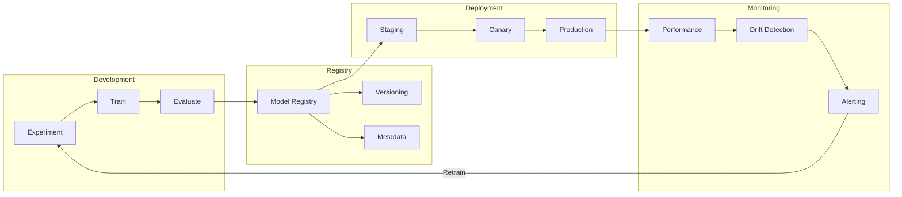
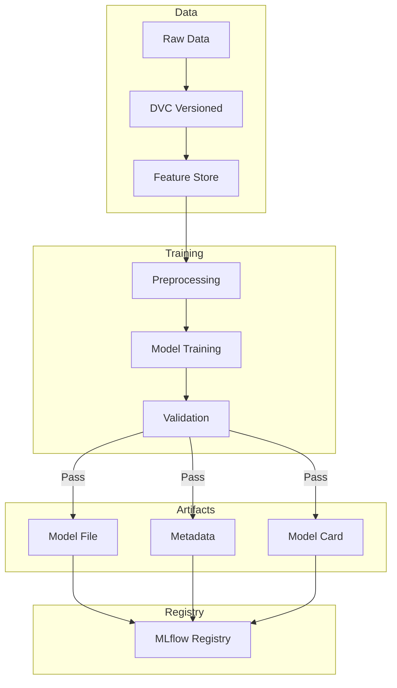
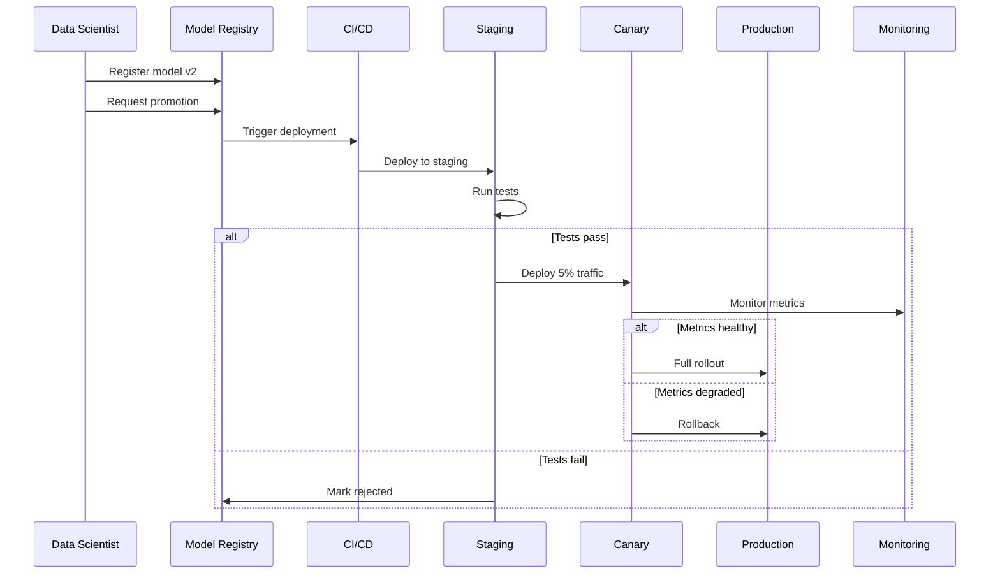
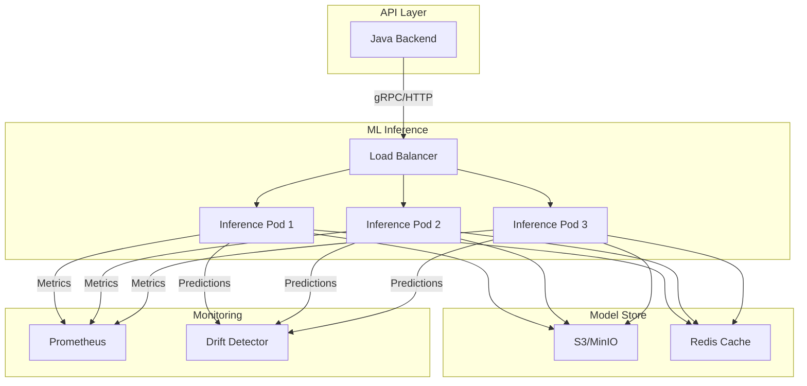
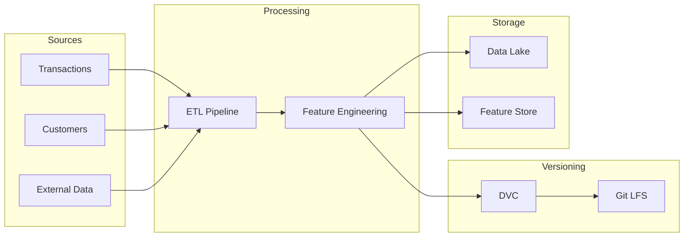
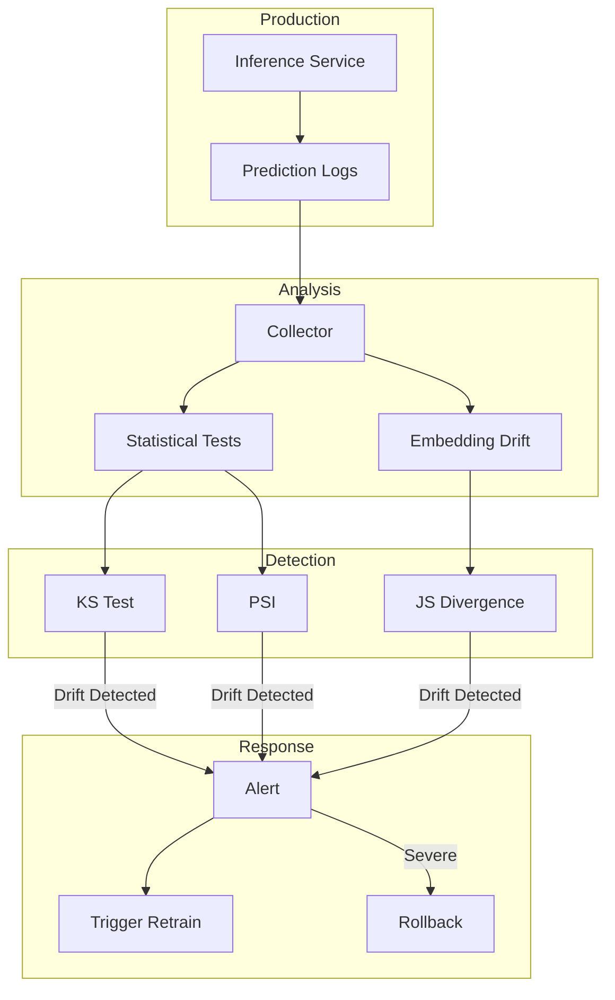
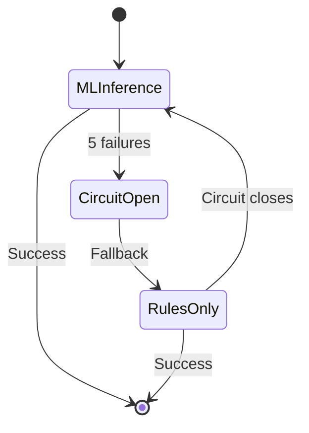

# MLOps Architecture

This document describes the Machine Learning Operations architecture for Hafnium.

---

## MLOps Lifecycle

---

## Training Pipeline

---

## Model Deployment Flow

---

## Inference Architecture

---

## Data Versioning

---

## Drift Detection Pipeline

---

## Model Governance

| Stage | Review Required | Approvers |
|-------|-----------------|-----------|
| Experiment | No | - |
| Candidate | Yes | Data Scientist Lead |
| Staging | Yes | ML Engineer |
| Production | Yes | Model Risk + Compliance |

---

## Metrics and SLOs

### Inference Service

| Metric | SLO | Measurement |
|--------|-----|-------------|
| Availability | 99.9% | Successful requests / Total |
| Latency P99 | 100ms | histogram_quantile |
| Error Rate | < 0.1% | 5xx / Total |

### Model Quality

| Metric | Threshold | Action |
|--------|-----------|--------|
| PSI | < 0.2 | Alert |
| AUC Drift | < 5% | Retrain |
| Prediction Shift | < 10% | Investigate |

---

## Fallback Strategy

When ML inference is unavailable:
1. Circuit breaker opens after 5 consecutive failures
2. Traffic routes to rules-only scoring
3. Alert fired to on-call
4. Circuit attempts reset after 30 seconds
