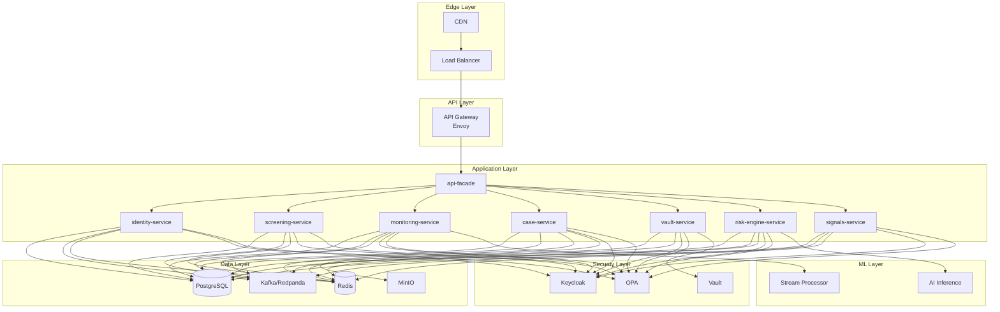
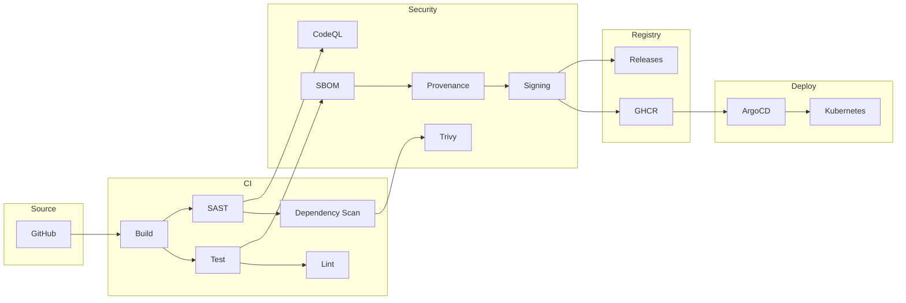
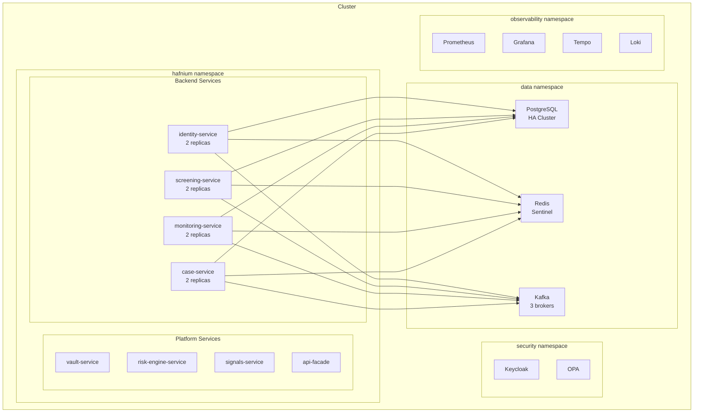
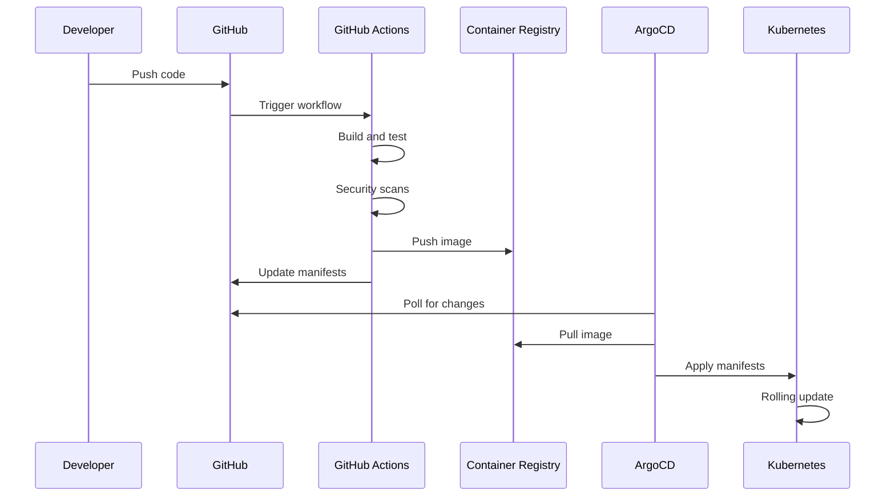
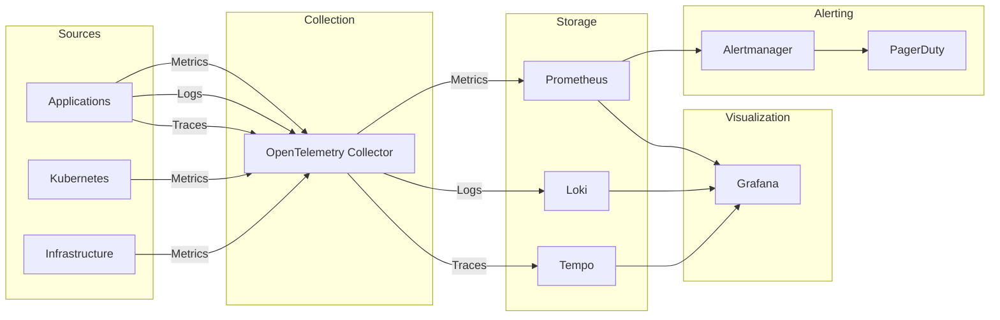
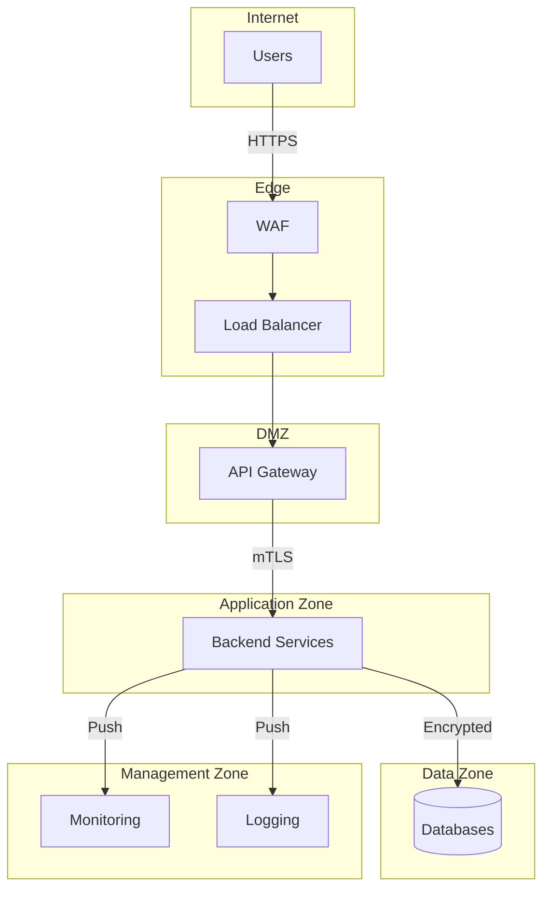

# Ops Architecture

This document describes the operational architecture of the Hafnium platform.

---

## Deployment Architecture

---

## CI/CD Pipeline

---

## Kubernetes Architecture

---

## GitOps Flow

---

## Observability Stack

---

## Disaster Recovery

| Component | RPO | RTO | Strategy |
|-----------|-----|-----|----------|
| Database | 1 hour | 4 hours | Continuous backup + PITR |
| Kafka | 0 | 30 min | Multi-broker replication |
| MinIO | 24 hours | 4 hours | Cross-region replication |
| Secrets | 0 | 1 hour | Vault HA + backup |

---

## Network Topology

