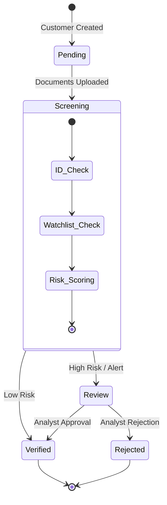
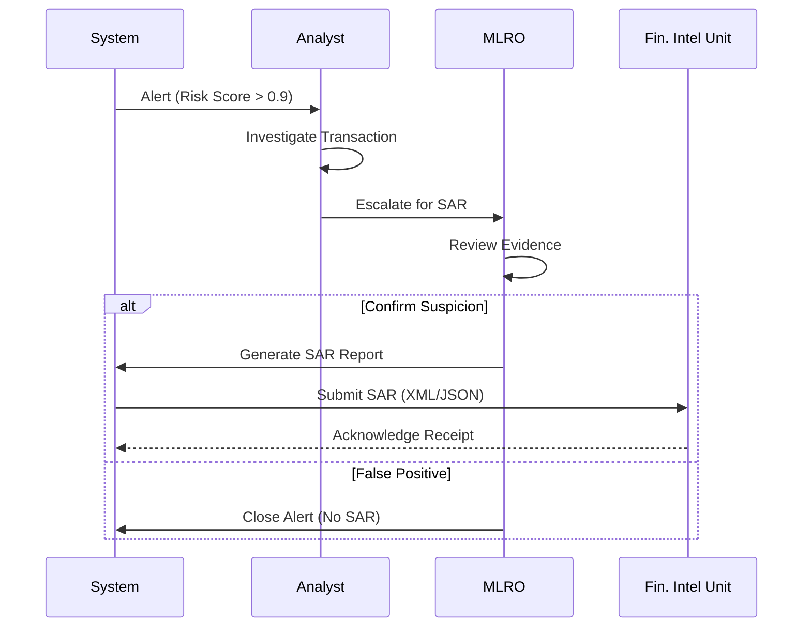

# KYC/AML Compliance Mapping

This document maps the Hafnium platform's technical controls to key Know Your Customer (KYC) and Anti-Money Laundering (AML) regulations.

---

## Regulatory Frameworks

- **USA**: Bank Secrecy Act (BSA), USA PATRIOT Act
- **EU**: 4th, 5th, 6th AML Directives (AMLD4/5/6)
- **UK**: Money Laundering Regulations 2017
- **Singapore**: MAS Notice 626

---

## Control Mapping Matrix

| Regulation ID | Requirement | Technical Control | Implementation | Verification |
|---------------|-------------|-------------------|----------------|--------------|
| **CIP (BSA)** | Customer Identification Program | Identity Verification API | `POST /api/v1/customers/kyc` | Automated Test |
| **CDD (AMLD5)** | Customer Due Diligence | Risk Scoring Engine | `RiskEngine.calculate_score()` | Unit Test |
| **EDD (AMLD5)** | Enhanced Due Diligence | High-risk Case Workflow | `CaseService.escalate()` | Integration Test |
| **SAR (BSA)** | Suspicious Activity Reporting | Alert Generation System | `StreamProcessor.emit_alert()` | E2E Scenario |
| **UBO (AMLD5)** | Ultimate Beneficial Ownership | Graph Relationship DB | `CustomerGraph.get_ubo()` | Data Validation |
| **WLF (OFAC)** | Watchlist Filtering | Fuzzy Matching Engine | `ScreeningService.match()` | Benchmark Set |

---

## Workflow Implementation

### KYC State Machine

### SAR Filing Process

---

## Data Retention Policy

| Data Type | Retention Period | Rationale |
|-----------|------------------|-----------|
| KYC Documents | 5 years after closure | BSA Recordkeeping |
| Transaction Logs | 5 years | BSA Recordkeeping |
| SAR Filings | 5 years | FinCEN Requirement |
| Alert History | 5 years | Audit Trail |

---

## Disclaimer

This document is for technical implementation guidance only. It does not constitute legal advice.
