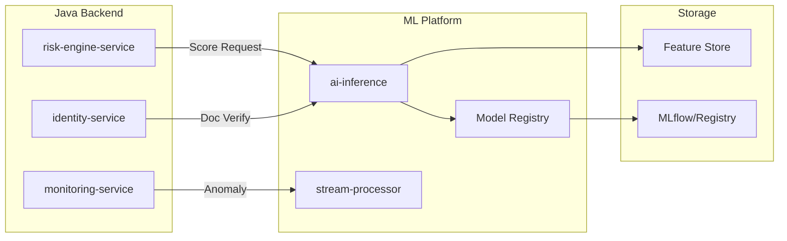
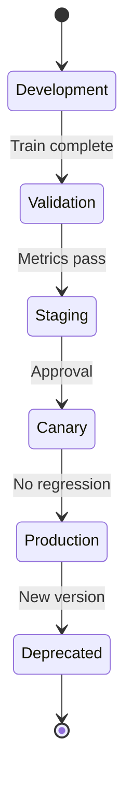

# Backend ML Integration

## Overview

The Hafnium backend integrates with ML services for risk scoring, document verification, and anomaly detection. This document describes the ML integration patterns and governance procedures.

## Architecture



## Integration Points

### Risk Engine ↔ AI Inference

The risk-engine-service calls the ai-inference service for ML-based risk predictions:

```java
@CircuitBreaker(name = "ml-inference", fallbackMethod = "predictFallback")
public MlPrediction predict(RiskScoreRequest request) {
    return webClient.post()
        .uri("/api/v1/predict")
        .bodyValue(request)
        .retrieve()
        .bodyToMono(MlPrediction.class)
        .block(Duration.ofSeconds(5));
}
```

### Fallback Behavior

When ML service is unavailable:
1. Circuit breaker opens after 5 consecutive failures
2. Rules-only scoring takes over
3. Event published: `ml.fallback.activated`
4. Ops alert triggered

```java
public MlPrediction predictFallback(RiskScoreRequest request, Exception ex) {
    LOG.warn("ML inference fallback: {}", ex.getMessage());
    metricsPublisher.incrementFallbackCounter();
    return null; // Triggers rules-only scoring
}
```

## Model Governance

### Model Registry

All production models registered with metadata:

| Field | Description |
|-------|-------------|
| `model_id` | Unique identifier |
| `model_version` | Semantic version |
| `input_schema` | Feature schema |
| `output_schema` | Prediction schema |
| `training_date` | When model was trained |
| `validation_metrics` | AUC, F1, recall |
| `approval_status` | approved/pending/rejected |

### Model Lifecycle



### Canary Deployment

Gradual rollout for new models:

```yaml
canary:
  enabled: true
  initialWeight: 5
  stepWeight: 10
  maxWeight: 100
  stepInterval: 1h
  metrics:
    - name: accuracy
      threshold: 0.95
    - name: latency_p99
      threshold: 100ms
```

## Decision Audit

All ML decisions persisted for audit:

```sql
CREATE TABLE risk_scores (
    score_id UUID PRIMARY KEY,
    tenant_id UUID NOT NULL,
    entity_id UUID NOT NULL,
    entity_type VARCHAR(50) NOT NULL,
    score DECIMAL(5, 4) NOT NULL,
    risk_level VARCHAR(50) NOT NULL,
    factors JSONB,
    model_id VARCHAR(100),
    model_version VARCHAR(50),
    created_at TIMESTAMPTZ NOT NULL
);
```

## Metrics

### ML-Specific Metrics

| Metric | Type | Description |
|--------|------|-------------|
| `hafnium.ml.prediction.duration` | Timer | Inference latency |
| `hafnium.ml.prediction.count` | Counter | Predictions made |
| `hafnium.ml.fallback.count` | Counter | Fallback activations |
| `hafnium.ml.model.version` | Gauge | Current model version |

### Dashboards

Grafana dashboards available:
- ML Service Health
- Model Performance
- Feature Drift Detection
- Prediction Distribution

## Feature Engineering

### Feature Store Integration

Features retrieved from feature store before inference:

```java
FeatureVector features = featureStore.getFeatures(
    entityId,
    List.of("txn_count_30d", "avg_amount", "country_risk", "account_age")
);
```

### Real-time Features

Computed at inference time:
- Transaction velocity
- Amount deviation
- Geographic distance

### Batch Features

Pre-computed daily:
- Customer behavior profile
- Historical aggregate statistics
- Network analysis scores

## Troubleshooting

### High Latency

1. Check ai-inference service health
2. Verify feature store connectivity
3. Review model complexity
4. Check network latency

### Prediction Drift

1. Monitor prediction distribution
2. Compare to baseline period
3. Check input feature quality
4. Consider model retraining

### Fallback Activated

1. Check circuit breaker state
2. Review ai-inference logs
3. Verify network connectivity
4. Check resource limits
