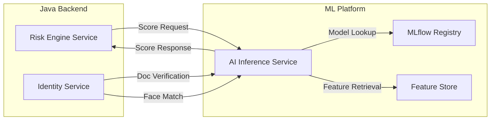
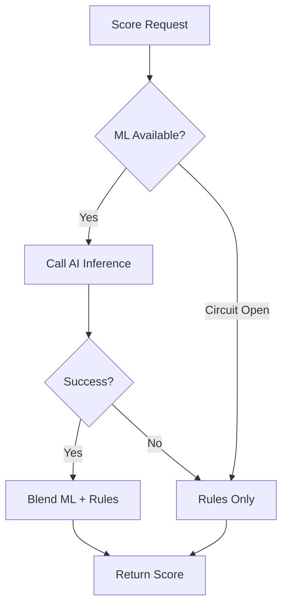

# Backend ML Integration

## Overview

The Hafnium backend integrates with the AI/ML platform to provide intelligent risk scoring, anomaly detection, and document verification. This document describes the MLOps integration from the backend perspective.

## Architecture



## Model Lifecycle Integration

### Model Registry Sync

The backend maintains a read-only mirror of model metadata from MLflow:

```sql
CREATE TABLE model_registry (
    model_id VARCHAR(100) PRIMARY KEY,
    model_name VARCHAR(255) NOT NULL,
    version VARCHAR(50) NOT NULL,
    status VARCHAR(50) NOT NULL,
    metrics JSONB,
    registered_at TIMESTAMP WITH TIME ZONE
);
```

### Canary Routing

The risk-engine-service supports canary routing via configuration:

```yaml
hafnium:
  risk:
    model:
      active-version: v1.0.0    # Primary model
      canary-version: v1.1.0    # Canary model (optional)
      canary-percentage: 10     # Traffic percentage to canary
```

### Fallback Strategy

When ML inference fails, the backend falls back to rule-only scoring:



## Decision Persistence

All risk decisions are persisted for audit and model training:

| Field | Description |
|-------|-------------|
| decision_id | Unique decision identifier |
| entity_type | customer, transaction, session |
| entity_id | Entity identifier |
| score | Computed risk score (0-1) |
| risk_level | LOW, MEDIUM, HIGH, CRITICAL |
| model_version | Model version used |
| reasons | Contributing factors (JSON) |
| computed_at | Timestamp |

## Inference Telemetry

The backend emits structured telemetry for each inference call:

```json
{
  "model_id": "risk-classifier",
  "model_version": "v1.0.0",
  "entity_type": "transaction",
  "latency_ms": 45,
  "output_distribution": {
    "low": 0.65,
    "medium": 0.25,
    "high": 0.08,
    "critical": 0.02
  },
  "feature_count": 47,
  "timestamp": "2024-12-16T21:00:00Z"
}
```

### Prometheus Metrics

| Metric | Type | Description |
|--------|------|-------------|
| `hafnium_ml_inference_total` | Counter | Total inference requests |
| `hafnium_ml_inference_errors_total` | Counter | Failed inferences |
| `hafnium_ml_inference_latency_seconds` | Histogram | Inference latency |
| `hafnium_ml_fallback_total` | Counter | Fallback activations |

## AI Inference Client

The backend uses a resilient HTTP client with circuit breaker:

```java
@CircuitBreaker(name = "ai-inference", fallbackMethod = "getScoreFallback")
public Double getScore(String entityType, String entityId, Map<String, Double> features) {
    return webClient.post()
        .uri("/api/v1/risk/predict")
        .bodyValue(request)
        .retrieve()
        .bodyToMono(InferenceResponse.class)
        .timeout(Duration.ofMillis(500))
        .block()
        .score();
}
```

### Circuit Breaker Configuration

| Parameter | Value | Description |
|-----------|-------|-------------|
| failureRateThreshold | 50% | Failure rate to open circuit |
| waitDurationInOpenState | 60s | Time before half-open |
| slidingWindowSize | 10 | Requests in sliding window |
| timeout | 500ms | Request timeout |

## Model Governance

### Auditability

Every risk decision includes:

1. **Model Version**: Exact model version used
2. **Feature Version**: Feature engineering version
3. **Reason Codes**: Explainable contributing factors
4. **Decision ID**: Unique identifier for tracing

### Model Cards

The backend exposes model card endpoints:

```
GET /api/v1/risk/models
GET /api/v1/risk/models/{model_id}/card
```

Model cards include:

- Model description and intended use
- Performance metrics (AUC-ROC, AUC-PR, ECE)
- Training data description
- Known limitations
- Fairness considerations

## Drift Detection Hooks

The backend supports drift detection by:

1. Logging feature distributions per inference
2. Tracking output distribution changes
3. Emitting alerts when distribution shifts exceed thresholds

```yaml
hafnium:
  risk:
    drift:
      enabled: true
      threshold: 0.15  # KL divergence threshold
      window-size: 1000  # Samples for comparison
```

## Retention Policy

| Data Type | Retention | Purpose |
|-----------|-----------|---------|
| Risk Decisions | 7 years | Regulatory compliance |
| Inference Telemetry | 90 days | Operational monitoring |
| Model Artifacts | Indefinite | Reproducibility |
| Feature Logs | 30 days | Drift detection |

## Safe Degradation

When ML is unavailable, the backend operates in "rules-only" mode:

1. Circuit breaker opens after failures
2. Conservative scoring applied (higher risk)
3. Automatic MANUAL_REVIEW policy action
4. Alert raised for operations team
5. Automatic recovery when ML returns

## Security Considerations

1. **No PII in inference requests**: Only anonymized feature vectors
2. **Model weights not stored in backend**: Retrieved from MLflow at runtime
3. **Encrypted communication**: mTLS between services
4. **Audit logging**: All model calls logged without sensitive data
