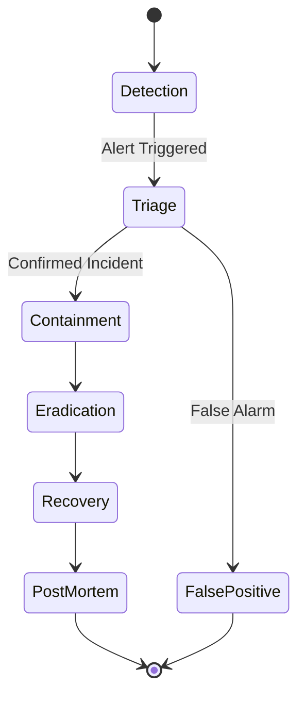

# Incident Response Plan

This document outlines the protocol for responding to security incidents and system outages.

---

## Incident Lifecycle

---

## Phases

### 1. Detection & Analysis
- **Sources**: Automated alerts (Prometheus/PagerDuty), User reports, Security notification.
- **Action**: Verify the anomaly. Check existing maintenance windows.

### 2. Triage & Declaration
- **Roles**:
    - **Incident Commander (IC)**: Leads the response.
    - **Scribe**: Logs timeline.
    - **Subject Matter Experts (SMEs)**: Diagnosis and fix.
- **Channels**: Create Slack channel `#inc-YYYYMMDD-description`. Start Zoom bridge.

### 3. Containment
**Priority**: Stop the bleeding.
- Isolate affected pods.
- Block malicious IPs at WAF/Envoy level.
- Revert recent deployments if correlation is found.

### 4. Eradication & Recovery
- Patch vulnerability.
- Restore clean data from backup.
- Verify system integrity.
- Gradual traffic ramp-up (Canary).

### 5. Post-Incident Activity
- **Root Cause Analysis (RCA)**: Using "5 Whys" technique.
- **Report**: Publish PDF report within 48 hours.
- **Jira**: Create backlog items for remediation and prevention.

---

## Escalation Matrix

| Component | Primary Contact | Secondary Contact |
|-----------|-----------------|-------------------|
| **Platform** | Platform Lead | DevOps On-call |
| **Security** | CISO | SecOps On-call |
| **Legal/PR** | General Counsel | Head of Comms |

---

## Checklists

### Security Breach
- [ ] Preserve logs (snapshot).
- [ ] Rotate compromised credentials.
- [ ] Notify Data Protection Officer (GDPR requirement: 72h).
- [ ] Engage forensics partner if needed.

### System Outage
- [ ] Check status page.
- [ ] Notify Customer Support.
- [ ] Verify database integrity.
